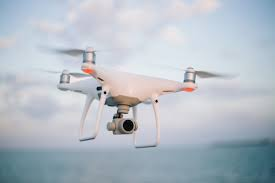

<!-- Improved compatibility of back to top link: See: https://github.com/othneildrew/Best-README-Template/pull/73 -->
<a name="readme-top"></a>
<!--
*** Thanks for checking out the Best-README-Template. If you have a suggestion
*** that would make this better, please fork the repo and create a pull request
*** or simply open an issue with the tag "enhancement".
*** Don't forget to give the project a star!
*** Thanks again! Now go create something AMAZING! :D
-->


<!-- PROJECT SHIELDS -->
<!--
*** I'm using markdown "reference style" links for readability.
*** Reference links are enclosed in brackets [ ] instead of parentheses ( ).
*** See the bottom of this document for the declaration of the reference variables
*** for contributors-url, forks-url, etc. This is an optional, concise syntax you may use.
*** https://www.markdownguide.org/basic-syntax/#reference-style-links
-->
[![Contributors][contributors-shield]][contributors-url]
[![Forks][forks-shield]][forks-url]
[![Stargazers][stars-shield]][stars-url]
[![Issues][issues-shield]][issues-url]
[![MIT License][license-shield]][license-url]
[![LinkedIn][linkedin-shield]][linkedin-url]


<!-- PROJECT LOGO -->
<br />
<div align="center">
  <a href="https://github.com/johan-stph/drone_final">
    
  </a>

<h3 align="center">DRONE PROJECT
</h3>

  <p align="center">
    This Project has the goal to land a tello drone on a turtle bot
    <br />
    <a href="https://github.com/johan-stph/drone_final"><strong>Explore the docs »</strong></a>
    <br />
    <br />
    <a href="https://github.com/johan-stph/drone_final">View Demo</a>
    ·
    <a href="https://github.com/johan-stph/drone_final/issues">Report Bug</a>
    ·
    <a href="https://github.com/johan-stph/drone_final/issues">Request Feature</a>
  </p>
</div>


<!-- TABLE OF CONTENTS -->
<details>
  <summary>Table of Contents</summary>
  <ol>
    <li>
      <a href="#about-the-project">About The Project</a>
      <ul>
        <li><a href="#built-with">Built With</a></li>
      </ul>
    </li>
    <li>
      <a href="#getting-started">Getting Started</a>
      <ul>
        <li><a href="#prerequisites">Prerequisites</a></li>
        <li><a href="#installation">Installation</a></li>
      </ul>
    </li>
    <li><a href="#usage">Usage</a></li>
    <li><a href="#roadmap">Roadmap</a></li>
    <li><a href="#contributing">Contributing</a></li>
    <li><a href="#license">License</a></li>
    <li><a href="#contact">Contact</a></li>
  </ol>
</details>


<!-- ABOUT THE PROJECT -->
## About The Project

[![Product Name Screen Shot][product-screenshot]](https://example.com)


<p align="right">(<a href="#readme-top">back to top</a>)</p>


### Built With

* [![Python][Python.org]][Python-url]

<p align="right">(<a href="#readme-top">back to top</a>)</p>


<!-- GETTING STARTED -->
## Getting Started

To get a local copy up and running follow these simple steps.

### Prerequisites

* Python 3.10
  ```sh
  brew install python@3.10
  ```

### Installation

1. Clone the repo
   ```sh
   git clone https://github.com/johan-stph/drone_final.git
   ```
2. Install the required dependencies
   ```sh
   pip install -r requirements.txt
   ```
3. Connect the drone via Wi-Fi
   
4. Run the application
   ```sh
   python application_v2.py
   ```

<p align="right">(<a href="#readme-top">back to top</a>)</p>


<!-- USAGE EXAMPLES -->
## Usage

This program is useful, if you ever find yourself in a situation where you would want to land a drone on a driving robot.

<p align="right">(<a href="#readme-top">back to top</a>)</p>


<!-- ROADMAP -->
## Roadmap


See the [open issues](https://github.com/johan-stph/drone_final/issues) for a full list of proposed features (and known issues).

<p align="right">(<a href="#readme-top">back to top</a>)</p>


<!-- CONTRIBUTING -->
## Contributing

Contributions are what make the open source community such an amazing place to learn, inspire, and create. Any contributions you make are **greatly appreciated**.

If you have a suggestion that would make this better, please fork the repo and create a pull request. You can also simply open an issue with the tag "enhancement".
Don't forget to give the project a star! Thanks again!

1. Fork the Project
2. Create your Feature Branch (`git checkout -b feature/AmazingFeature`)
3. Commit your Changes (`git commit -m 'Add some AmazingFeature'`)
4. Push to the Branch (`git push origin feature/AmazingFeature`)
5. Open a Pull Request

<p align="right">(<a href="#readme-top">back to top</a>)</p>


<!-- LICENSE -->
## License

Distributed under the MIT License. See `LICENSE.txt` for more information.

<p align="right">(<a href="#readme-top">back to top</a>)</p>


<!-- CONTACT -->
## Contact

Johannes Stephan - johannes.uni.kit@gmail.com

Project Link: [https://github.com/johan-stph/drone_final](https://github.com/johan-stph/drone_final)

<p align="right">(<a href="#readme-top">back to top</a>)</p>


<!-- MARKDOWN LINKS & IMAGES -->
<!-- https://www.markdownguide.org/basic-syntax/#reference-style-links -->
[contributors-shield]: https://img.shields.io/github/contributors/johan-stph/drone_final.svg?style=for-the-badge
[contributors-url]: https://github.com/johan-stph/drone_final/graphs/contributors
[forks-shield]: https://img.shields.io/github/forks/johan-stph/drone_final.svg?style=for-the-badge
[forks-url]: https://github.com/johan-stph/drone_final/network/members
[stars-shield]: https://img.shields.io/github/stars/johan-stph/drone_final.svg?style=for-the-badge
[stars-url]: https://github.com/johan-stph/drone_final/stargazers
[issues-shield]: https://img.shields.io/github/issues/johan-stph/drone_final.svg?style=for-the-badge
[issues-url]: https://github.com/johan-stph/drone_final/issues
[license-shield]: https://img.shields.io/github/license/johan-stph/drone_final.svg?style=for-the-badge
[license-url]: https://github.com/johan-stph/drone_final/blob/master/LICENSE.txt
[linkedin-shield]: https://img.shields.io/badge/-LinkedIn-black.svg?style=for-the-badge&logo=linkedin&colorB=555
[linkedin-url]: https://linkedin.com/in/linkedin_username
[product-screenshot]: images/drone-picture.png
[Python.org]: https://img.shields.io/badge/Python-3776AB?style=for-the-badge&logo=python&logoColor=white
[Python-url]: https://www.python.org/
